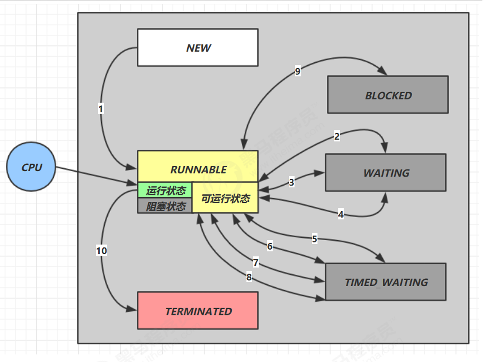

# JUC 学习笔记

## Synchronized

使用**对象锁**来进行并发控制，最常见的一种并发控制方法，利用了操作系统提供的 monitor。

### wait-notify

一种**线程通信方式**，当一个线程抢到了锁，但由于某些条件无法执行，会使用`wait`方法，进入等待队列，并释放手中的锁。当条件满足时，会调用`notify`方法将等待的线程唤醒。

p.s. 这两个方法都只能在同步代码块里面使用

**代码示例**

```java
synchronized(lock) {
    while(条件不成立) {
        lock.wait();
    }
    // 干活
}
 //另一个线程
synchronized(lock) {
    // 发现条件满足
    lock.notifyAll();
 }
```


## 线程的六种状态




## 线程池

### 线程池的执行流程

1. 提交任务
2. 若有空闲线程，执行；否则，进入阻塞队列，若队列已满且线程全部忙碌会执行拒绝策略。
3. 线程执行完任务会回到线程池，满足一定条件时，空闲线程会被销毁。

### 线程池缩容如何感知

1. 定期查询线程池的 `getPoolSize()`、`getActiveCount()` 等属性；

2. 监控拒绝策略的触发情况；

3. 自定义钩子方法来跟踪线程池状态的变化。


## 多线程常用模式

### 保护性暂停


### 两阶段终止模式

使用 `interrput` 优雅地停止一个线程的活动。

**代码示例**

```java
@Slf4j
class TwoPhaseTermination {
    // 定期执行任务的监视器
    private Thread monitor;

    public void start() {
        monitor = new Thread(() -> {
            while(true){
                Thread thread = Thread.currentThread();
                // 检查是否被打断
                if(thread.isInterrupted()){
                    log.debug("料理后事");
                    break;
                }
                try {
                    Thread.sleep(2500);
                } catch (InterruptedException e) {
                    log.debug("出现异常", e);
                    thread.interrupt();
                }
                log.debug("执行监控任务");
            }
        });

        monitor.start();
    }
    public void stop(){
        monitor.interrupt();
    }
}
```

