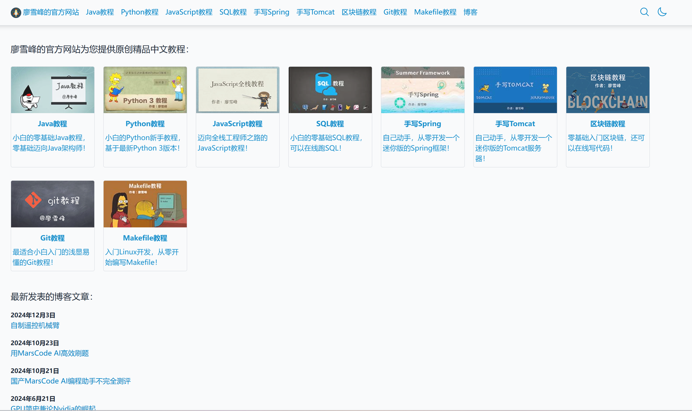
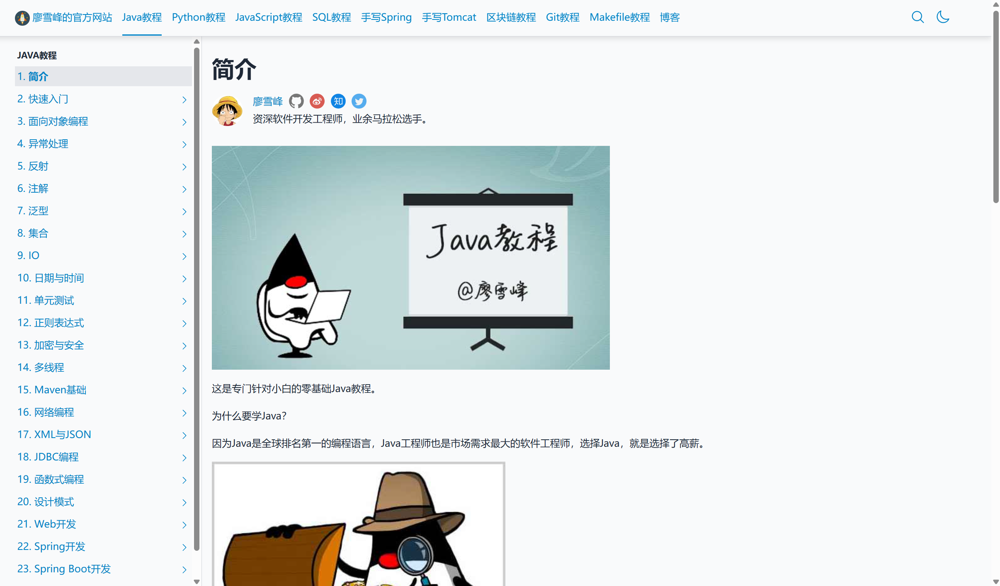

# 个人博客网站设计

## 前言

买了一个域名，发现除了博客网站外都不太好备案，索性就搭建一个个人博客网站，刚好自己也想通过输出来巩固自己的学习.

## 需求分析

1. 需要能够解析 **markdown** 文件
2. 需要展示作者信息、学习笔记、文章、面经等板块的内容
3. 需要一个比较精美的排版和布局
4. 需要加入网站娘的功能
5. 需要提供注册登录，评论的功能。
6. 需要统计访客的数量

## 界面参考

### 1. [ 廖雪峰的官方网站](https://liaoxuefeng.com/)

